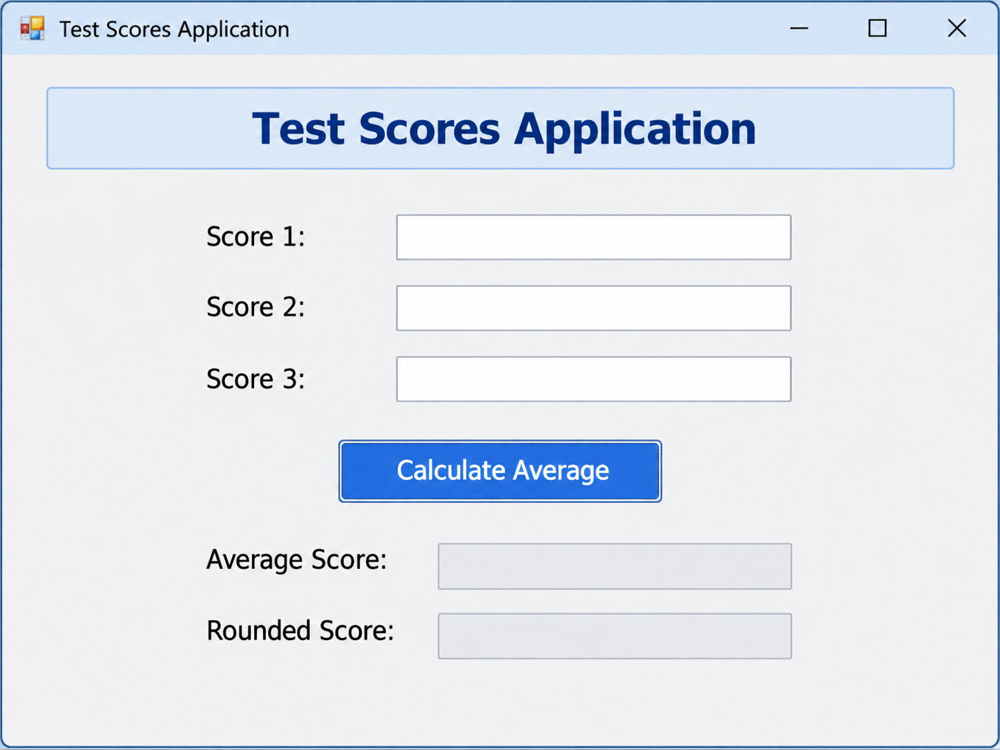
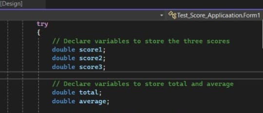
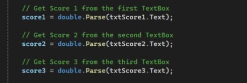
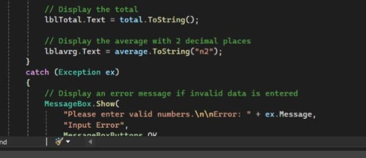

# Test Score Application

A simple C# Windows Forms application designed to calculate the total and average of three test scores.

This project was created as a practical exercise to understand basic C# programming concepts and Windows Forms application development.

---

## 🖥️ Application Design

The application provides a simple graphical interface where the user can enter three test scores and calculate the total and average.

---

## 1. Creating Variables

The application uses variables to store the test scores, total score, and average score.

The variables are used to temporarily hold the values entered by the user and the results calculated by the application.

---

## 2. Reading User Input

The application receives the three test scores from the TextBox controls.

The entered values are converted from text into numeric values so that they can be used in mathematical calculations.

---

## 3. Calculating Total and Average

After receiving the three test scores, the application calculates the total and average.

The total is calculated by adding the three scores together.

The average is calculated by dividing the total score by the number of scores.

---

## 4. Displaying Results and Handling Errors

After the calculations are completed, the application displays the total and average on the form.

The average is formatted to display two decimal places.

The application also uses exception handling to prevent the program from crashing when the user enters invalid input.

If invalid data is entered, an error message is displayed to inform the user that valid numbers are required.

